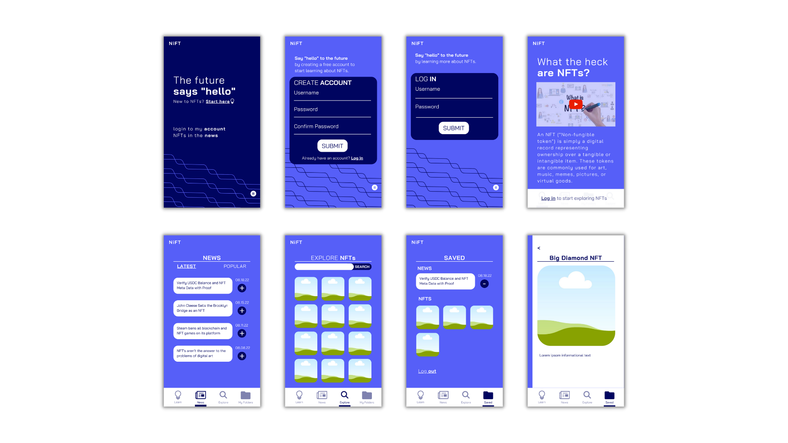

# Welcome to NiFT

A web application that allows users to learn about NFTs, read related news articles, and explore the actual NFT marketplace. Users can save articles and NFTs to their account for future reference.

## Installation
The live web application can be accessed at [NiFT Web Application](https://nift-app.netlify.app/). Other links:

> Github
> - [Front End Code](https://github.com/mickrueg/nift-frontend)
> - [Back end Code](https://github.com/mickrueg/nift-backend)
> 
> Live
> - [Front End](https://nift-app.netlify.app/)
> - [Back End](https://nift-backend-two.herokuapp.com/)

## Front End Technologies
### Code Base
NiFT was built with React JS and CSS. 
### Animations
The app uses a variety of important CSS animations to create an interactive and enjoyable user experience. Some key animations include:
- Start Page Digital Wave
    - Created using svg file and key frames
    - The key frames move the svg file to the right and down by one unit
    - The svg file is assigned the animation on an infinite loop
    - The end result is that the wave appears to be on a continuous flow
- NFT Info Modal Push
    - Used a combination of React State and CSS to push the page to the left when a user clicks on an NFT
- Auto Refresh when an item is deleted from Saved Page
    - Used React Context to track the changing of state
    - When a user deletes a record, UseEffect is triggered to rerender the Saved Folder

## Back End Technologies
### Password Encryption

Bcrypt is used to hash the users' passwords at initial account creation and check their passwords at login.

- Create Account
    - In a post request, the user's password is sent through bcreypt.hash
- Login
    - In a post request, the user's password is sent through createUserToken method
    - If a token is created, then bcrypt verified the password is correct
    - If a token fails and an error is printed, then the password does not match the original

## Original Wireframe

## User Stories
- As a young professional, I want to educate myself on NFTs to prepare for the future.
- As an artist, I want to learn how NFTs can help my business.
- As a curious person, I want to explore the NFT marketplace.

## Approach Taken (Steps Followed)

1. Build wireframe on Canva (Intro page, login, learn page, explore page, navbar, news page, saved page)
2. Design backend models (user, articles, NFTs) and code back end with MongoDB/Express/Node
3. Deploy backend to Heroku
4. Design React Component hierarchy and create a base CSS file (h1-h5 fonts, color scheme, window sizing)
5. Build dynamic code with React JS
6. Deploy frontend to Netlify

## New Technologies and Challenges

I had a great time building this project and testing out new technologies! Some of the big "new" items I tackled on this project include:
- Creating a user login and using password hashing
- Using localstorage to identiy logged in user
- Using keyframes to create an infinite loop animation
- Deploying a back end database to Heroku
- Using multiple APIs

The biggest hiccups I ran into when building this web application were:
- <b>Verifying hashed passwords:</b> This was my first time using bcrypt. I understood how to use Bcrypt just fine, however, I struggled with creating a back end HTTP request to check on encrypted passwords. After reviewing the course material, I was finally able to successfully produce usable code!
- <b>API Requests:</b> I ran into a hurdle where an API I wanted to use did not allow hosting services to make requests. Meaning, I did not discover this issue until I deployed my app to Netlify (so I scratched that API). I ran into another API hurdle with CORS (so I scratched that API). And then, I ran into another issue where Netlify did not allow me to make an "HTTP" request, but instead had to make "HTTPS" request. I did not quite understand what this meant, but I simply updated the base URL with "HTTPS" at the beginning and had success!

In conclusion, I learned a lot while working on this project. I feel well-prepared to enter the tech community as a Full-Stack Software Engineer!